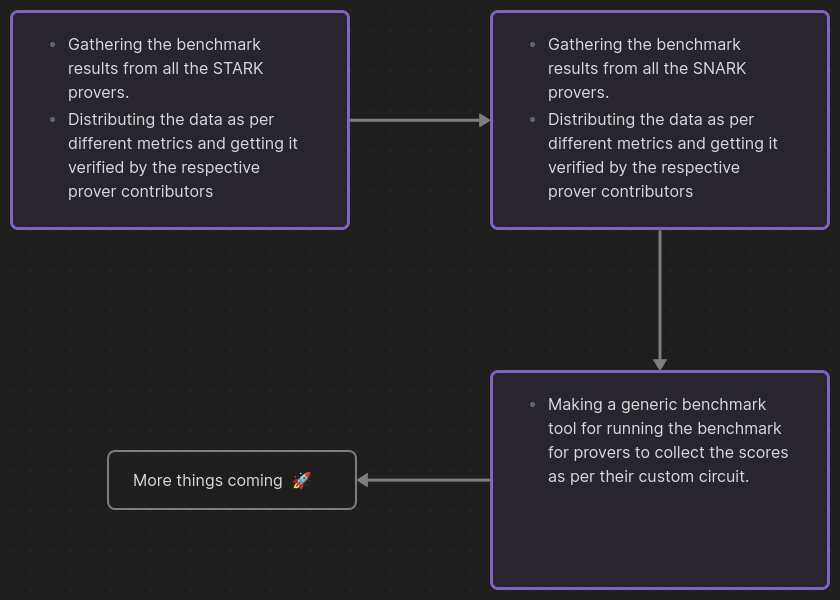

# uZumaKi Benchmarking Suite

</img>

## Index

- [uZumaKi Benchmarking Suite](#uzumaki-benchmarking-suite)
  - [Index](#index)
  - [About uZumaKi](#about-uzumaki)
  - [Vision](#vision)
  - [OpenSource \& Community-Driven](#opensource--community-driven)
  - [Goals](#goals)
  - [Current Benchmarks](#current-benchmarks)
  - [Roadmap](#roadmap)
  - [Get Involved](#get-involved)
  - [Resources](#resources)
    - [Github Repositories](#github-repositories)
    - [Articles](#articles)
    - [Benchmarking](#benchmarking)

## About uZumaKi

Uzumaki is an open-source benchmarking suite for zero-knowledge (ZK) proof systems. Our goal is to provide standardized benchmarks and comparative analyses to drive innovation and adoption of ZK technologies.
As the ZK ecosystem grows rapidly, the lack of consistent benchmarking makes it challenging for developers to compare different languages, compilers, provers, and other components. Uzumaki aims to solve this by offering a comprehensive benchmarking methodology.
This will allow benchmarking across multiple proving systems, DSL, sequencers and also provide hardware agnostic comparison using modular multiplication to provide an apple to apple comparison.

## Vision

We envision Uzumaki becoming an industry standard for evaluating performance and capabilities across the full spectrum of ZK systems. Whether companies are building core protocol components or integrating ZK proofs into products, Uzumaki benchmarks will help guide technical decision making.
In the long-term, we believe widespread benchmarking will accelerate real-world ZK adoption, enabling more private and secure data collaboration across industries. Uzumaki strives to play a key role in realizing this future.

## OpenSource & Community-Driven

Uzumaki is fully open-source and community-driven by a team of ZK enthusiasts spanning industry and academia. We welcome constructive ideas and participation from the broader community.
Together, we can create benchmarking standards that keep pace with rapidly evolving ZK innovations, providing the insights needed to turn cryptographic research into tomorrow's privacy infrastructure.

## Goals

1. **Variety of Systems**: Numerous ZK proof systems exist, each with unique features and optimizations, necessitating a method for comparison.
2. **Targeted Applications**: Different systems are tailored for specific use cases, making benchmarking essential to identify the best fit for a particular application.
3. **No Universal Solution**: Each system has its own trade-offs in terms of efficiency and capabilities, highlighting the need for a comparative analysis.
4. **Rapid Evolution**: The fast-paced innovation in ZK proofs requires a way to track and evaluate new advancements and their impact.
5. **Computational Efficiency**: Benchmarking provides insights into the proof generation and verification speeds of different systems.
6. **Scalability Insights**: Understanding how systems handle increasing computational complexities is crucial for large-scale applications.
7. **Security Comparison**: Evaluating varying security levels across different systems is vital for ensuring data integrity and privacy.
8. **Resource Demand Analysis**: Assessing CPU and memory usage helps in determining the practical deployment of ZK systems.
9. **Informed Decision-Making**: Empirical data from benchmarking aids developers and researchers in choosing the most suitable system.
10. **Standardization Aid**: Benchmarking supports the standardization process in ZK proofs by establishing performance and best practice benchmarks.

Benchmarking ZK proofs is not just about performance metrics; it's a comprehensive process that evaluates suitability for specific applications, scalability, security, and practicality, thereby guiding the evolving landscape of cryptographic privacy and data integrity solutions.

## Current Benchmarks

## Roadmap

More info on roadmap : [Roadmap.md](./Roadmap.md)

## Get Involved

We are on a quest to revolutionize how ZK technology is evaluated and perceived. If you share our passion for advancing ZK proofs, we welcome your expertise, ideas, and participation. Together, we can forge a path towards a more private, secure, and efficient digital world.
Things on the roadmap for community:

- To create issues and tasks for community to contribute and make it better

## Resources

### Github Repositories

- <https://github.com/delendum-xyz/zk-benchmarking>
- <https://github.com/zkCollective/zk-Harness>
- <https://github.com/celer-network/zk-benchmark>
- <https://github.com/polybase/zk-benchmarks>
- <https://github.com/delendum-xyz/zk-benchmarking>
- <https://github.com/ingonyama-zk/icicle>
- C++ CPU Groth16 Prover:
  <https://github.com/MinaProtocol/snark-challenge-prover-reference>
- Cuda GPU Groth16 Prover:
  <https://github.com/MinaProtocol/gpu-groth16-prover-3x>
- Prize's MSM Implementation:
  <https://github.com/z-prize/test-msm-gpu>
- TalDerie Master Research:
  <https://github.com/TalDerei/Masters-Research>
- Plonk: Permutations over Lagrange-bases for ecumenical Noninteractive
  Arguments of Knowledge:
  <https://eprint.iacr.org/2019/953>
- Barretenberg
  <https://github.com/AztecProtocol/barretenberg>
- Ignition-Verification
  <https://github.com/AztecProtocol/ignition-verification>

### Articles

- <https://ethresear.ch/t/benchmarking-zkp-development-frameworks-the-pantheon-of-zkp/14943>
- <https://hackmd.io/@heliax/SJU01u5fs>
- <https://eprint.iacr.org/2023/1503>
- Aztec's ZK-ZK-Rollup, Looking Behind the Cryptocurtain:
  <https://medium.com/aztec-protocol/aztecs-zk-zk-rollup-looking-behind-the-crypte>
  curtain-2b8af1fca619
- Aleo's Prize Competition:
  <https://www.zprize.io/prizes/accelerating-msm-operations-on-gpu-fpga>

### Benchmarking

- <https://www.zk-bench.org/>
- <https://zkbench.dev/>
