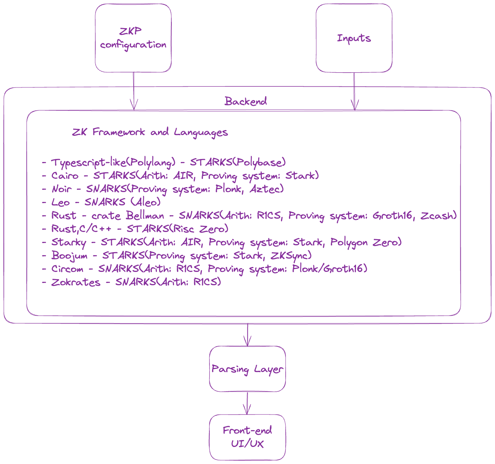
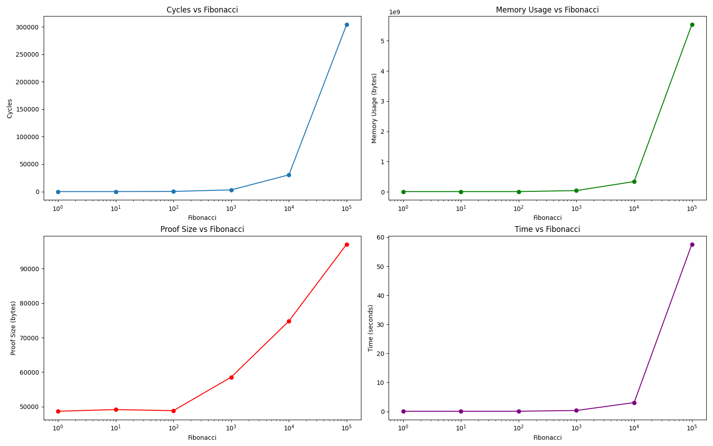
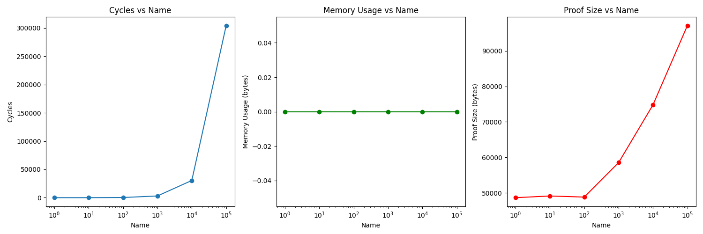

# uZumaKi Benchmarking Suite

<div align='center'>
</img>
</div>

# Index

- [uZumaKi Benchmarking Suite](#uzumaki-benchmarking-suite)
- [Index](#index)
- [About](#about)
- [Vision](#vision)
- [OpenSource & Community-Driven](#opensource&community-driven)
- [Goals](#goals)
- [Current Benchmarks](#current-benchmarks)
- [Comparison between ZK Circuit Development Frameworks](#comparison-between-zk-circuit-development-frameworks)
  - [High-Level Language/DSL](#high-level-languagedsl)
    - [STARKs](#starks)
    - [SNARKs](#snarks)
  - [Low-Level Language](#low-level-language)
    - [STARKs](#starks-1)
  - [Proof Systems](#proof-systems)
  - [Groth16 Frameworks](#groth16-frameworks)
  - [Plonk Frameworks](#plonk-frameworks)
  - [Arithmetic Operations](#arithmetic-operations)
  - [Elliptic Curve Operations](#elliptic-curve-operations)
  - [DSL circuit Benchmarks without proving system](#dsl-circuit-benchmarks-without-proving-system)
  - [Assessments](#assessments)
  - [Testing Systems Under Heavy Load](#testing-systems-under-heavy-load)
  - [Type of Platform Specification for Testing](#type-of-platform-specification-for-testing)
  - [Future Work](#future-work)
  - [Benchmarks](#benchmarks)
- [Resources](#resources)
  - [Github Repositories](#github-repositories)
  - [Articles](#articles)
  - [Benchmarking](#benchmarking)

# About uZumaKi 
Uzumak is an open-source benchmarking suite for zero-knowledge (ZK) proof systems. Our goal is to provide standardized benchmarks and comparative analyses to drive innovation and adoption of ZK technologies.
As the ZK ecosystem grows rapidly, the lack of consistent benchmarking makes it challenging for developers to compare different languages, compilers, provers, and other components. Uzumak aims to solve this by offering a comprehensive benchmarking methodology.
This will allow benchmarking across multiple proving systems, DSL, sequencers and also provide hardware agnostic comparison using modular multiplcation to provide an apple to apple comparison.

# Vision
We envision Uzumak becoming an industry standard for evaluating performance and capabilities across the full spectrum of ZK systems. Whether companies are building core protocol components or integrating ZK proofs into products, Uzumak benchmarks will help guide technical decision making.
In the long-term, we believe widespread benchmarking will accelerate real-world ZK adoption, enabling more private and secure data collaboration across industries. Uzumak strives to play a key role in realizing this future.

# OpenSource & Community-Driven
Uzumak is fully open-source and community-driven by a team of ZK enthusiasts spanning industry and academia. We welcome constructive ideas and participation from the broader community.
Together, we can create benchmarking standards that keep pace with rapidly evolving ZK innovations, providing the insights needed to turn cryptographic research into tomorrow's privacy infrastructure.


# Goals

1. **Variety of Systems**: Numerous ZK proof systems exist, each with unique features and optimizations, necessitating a method for comparison.
2. **Targeted Applications**: Different systems are tailored for specific use cases, making benchmarking essential to identify the best fit for a particular application.
3. **No Universal Solution**: Each system has its own trade-offs in terms of efficiency and capabilities, highlighting the need for a comparative analysis.
4. **Rapid Evolution**: The fast-paced innovation in ZK proofs requires a way to track and evaluate new advancements and their impact.
5. **Computational Efficiency**: Benchmarking provides insights into the proof generation and verification speeds of different systems.
6. **Scalability Insights**: Understanding how systems handle increasing computational complexities is crucial for large-scale applications.
7. **Security Comparison**: Evaluating varying security levels across different systems is vital for ensuring data integrity and privacy.
8. **Resource Demand Analysis**: Assessing CPU and memory usage helps in determining the practical deployment of ZK systems.
9. **Informed Decision-Making**: Empirical data from benchmarking aids developers and researchers in choosing the most suitable system.
10. **Standardization Aid**: Benchmarking supports the standardization process in ZK proofs by establishing performance and best practice benchmarks.

Benchmarking ZK proofs is not just about performance metrics; it's a comprehensive process that evaluates suitability for specific applications, scalability, security, and practicality, thereby guiding the evolving landscape of cryptographic privacy and data integrity solutions.



# Current Benchmarks

```sh
System Info :
-------------
CPU : Intel i7 12th gen
RAM : 16 GB
GPU : NVIDIA 4050 6 GB, Intel Graphics Driver 6 GB
```

| Language              | Prover          | Verifier                 | Circuit                | Proving Time                                 | Verifying Time                | Proof Type |
| --------------------- | --------------- | ------------------------ | ---------------------- | -------------------------------------------- | ----------------------------- | ---------- |
| MASM (Miden Assembly) | Miden (Polygon) | Miden_Verifier (Polygon) | Fibonacci              | low : `75.80179` ms, high : `603.645856` ms  | low : `47` ns, high : `49` ns | STARK      |
|                       |                 |                          | merkle tree merging    | low : `95.690374` ms, high : `211.495254` ms | low : `57` ns, high : `62` ns | STARK      |
|                       |                 |                          | merkle tree membership | `79.863758` ms                               | `47` ns                       | STARK      |
| Cairo-0               | Stone           | Stone                    | Fibonacci              | `1.84836` s                                  | 100 ns                        | STARK      |
| Rust                  | RiscZero VM     | RiscZero Verifier        | Fibonacci              | low: `714` ms, high : `3803` ms              | low : `74` ns, high : `89` ns | STARK      |

# Comparison between ZK Circuit Development Frameworks

## High-Level Language/DSL

### STARKs

| Prover         | Language/Library           | Arithmetization |
| -------------- | -------------------------- | --------------- |
| Stone          | Cairo                      | AIR             |
| Miden          | PolyLang (typescript-like) | -               |
| RiskZero zkVM  | Rust, C , C++              | -               |
| Boojum(ZKSync) | Rust , C , C++             | -               |

### SNARKs

| Prover         | Language/Library | Arithmetization |
| -------------- | ---------------- | --------------- |
| Plonk          | Noir             | -               |
| Aleo           | Leo              | -               |
| Groth16        | Bellman (Rust)   | R1CS            |
| Groth16        | Circom           | R1CS            |
| Marlin/Groth16 | Zokrates         | R1CS            |

## Low-Level Language

### STARKs

| Language |
| -------- |
| MASM     |
| Risc 5   |

## Proof Systems

- Groth16
- Plonk
- Marlin/Marlin'
- Stark

## Groth16 Frameworks

- Gnark
- Rapidsnark
- Arkworks
- Snarkjs
- Bellman
- Zokrates
- Libsnark

## Plonk Frameworks

- Plonky2
- Halo2
- Aztec (Implementation of Plonk)
- Hercules (Rust-based with Plonk support)

## Arithmetic Operations

- inv
- mul
- sub
- exp
- add

## Elliptic Curve Operations

- g1-scalar-multiplication
- g2-multi-scalar-multiplication
- pairing
- g2-scalar-multiplication
- g1-multi-scalar-multiplication

## DSL circuit Benchmarks without proving system

- Independent of proving scheme limitations: Some proving systems may have limitations or optimizations that can skew the understanding of a DSL's capabilities. Comparing DSLs independently allows for an evaluation that is not influenced by such factors.
- By comparing DSLs independently of specific proving systems, you can focus on the efficiency and optimization of circuit design. This allows for an assessment of how well each DSL facilitates the creation of efficient and optimized circuits.
- Language features, learning curve
- Analysis under heavy load
- Tooling and ecosystem support

## Assessments

- Prover performance
- Verifier performance
- Proof size
- Proof Generation Time (including witness generation time)
- Peak Memory usage during proof generation
- Average CPU Utilization % during proof generation (Reflects parallelization degree)
- Proof cost (Dependent on field and curve efficiency, proof techniques, and computation model)
- EVM Verifier
- External libraries support
- Ease of Use: Learning curve and user-friendliness of each DSL
- Security Features: Built-in security measures of each DSL
- Community and Ecosystem: Community size, resources, documentation, and support
- Version Tracking: Include version numbers of DSLs for updates and improvements
- Parallelization and Scalability: Support for parallel computations and scaling

## Additional Assesments

### 1. Apple to Apple comparison between different hardware systems

Modular Arithmetic Focus: Prioritize modular multiplication operations per second (MMOPS) as a key metric, offering a more concrete and comparable measure across different systems.
Field-Specific Benchmarks: Include benchmarks for different field sizes (e.g., 256-bit, 384-bit) to capture performance nuances across various cryptographic fields.

### 2. Comprehensive Power Efficiency Analysis:
MMOPS/Watt Metric: Adopt a standardized MMOPS/Watt metric for a direct comparison of power efficiency across different hardware setups.
Total Cost of Ownership (TCO): Include a more detailed analysis of TCO, factoring in hardware costs, operational expenses, and potential resale values to provide a holistic view of economic efficiency.

### 3. Hardware and System Diversity:
Diverse Hardware Testing: Test ZKP systems on a variety of hardware, including CPUs, GPUs, FPGAs, and ASICs, to understand performance across different computational platforms.
System Scalability Analysis: Assess how systems scale with increased complexity and workload, providing insights into their real-world applicability.


## Testing Systems Under Heavy Load

- Complexity addition via advanced constraints (hashing algorithms, arrays, booleans, data structures, recursion)
  

## Type of Platform Specification for Testing

- **Linux Server**: 20 Cores @ 2.3 GHz, 384GB memory
- **Macbook M1 Pro**: 10 Cores @ 3.2Ghz, 16GB memory
- Icicle: (TBD)

## Future Work

- DSL frameworks without proving systems
- Compute on Icicle
- Benchmarking sequencers
- Benchmarking different zkVMs (e.g., Scroll, Polygon zkEVM, Consensys zkEVM, zkSync, Risc Zero, zkWasm)
- Benchmarking IR compiler frameworks (e.g., zkLLVM)

## Benchmarks

Miden Starks Fibonacci Prover:


Miden Starks Fibonacci Verify:


Map of curves/Fields with Frameworks and languages


Model of UI for circuit benchmarks:

(<https://hackmd.io/_uploads/rkrlJP2B6.png>)

Metric can be time, ram and proof

Arithmetic Backends


Elliptic curve benchmarks


# Get Involved
We are on a quest to revolutionize how ZK technology is evaluated and perceived. If you share our passion for advancing ZK proofs, we welcome your expertise, ideas, and participation. Together, we can forge a path towards a more private, secure, and efficient digital world.
Things on the roadmap for community:
- To create issues and tasks for community to contribute and make it better


# Resources

### Github Repositories

- <https://github.com/delendum-xyz/zk-benchmarking>
- <https://github.com/zkCollective/zk-Harness>
- <https://github.com/celer-network/zk-benchmark>
- <https://github.com/polybase/zk-benchmarks>
- <https://github.com/delendum-xyz/zk-benchmarking>
- <https://github.com/ingonyama-zk/icicle>
- C++ CPU Groth16 Prover:
  <https://github.com/MinaProtocol/snark-challenge-prover-reference>
- Cuda GPU Groth16 Prover:
  <https://github.com/MinaProtocol/gpu-groth16-prover-3x>
- Prize's MSM Implementation:
  <https://github.com/z-prize/test-msm-gpu>
- TalDerie Master Research:
  <https://github.com/TalDerei/Masters-Research>
- Plonk: Permutations over Lagrange-bases for ecumenical Noninteractive
  Arguments of Knowledge:
  <https://eprint.iacr.org/2019/953>
- Barretenberg
  <https://github.com/AztecProtocol/barretenberg>
- Ignition-Verification
  <https://github.com/AztecProtocol/ignition-verification>

### Articles

- <https://ethresear.ch/t/benchmarking-zkp-development-frameworks-the-pantheon-of-zkp/14943>
- <https://hackmd.io/@heliax/SJU01u5fs>
- <https://eprint.iacr.org/2023/1503>
- Aztec's ZK-ZK-Rollup, Looking Behind the Cryptocurtain:
  <https://medium.com/aztec-protocol/aztecs-zk-zk-rollup-looking-behind-the-crypte>
  curtain-2b8af1fca619
- Aleo's Prize Competition:
  <https://www.zprize.io/prizes/accelerating-msm-operations-on-gpu-fpga>

### Benchmarking

- https://www.zk-bench.org/
- https://zkbench.dev/
